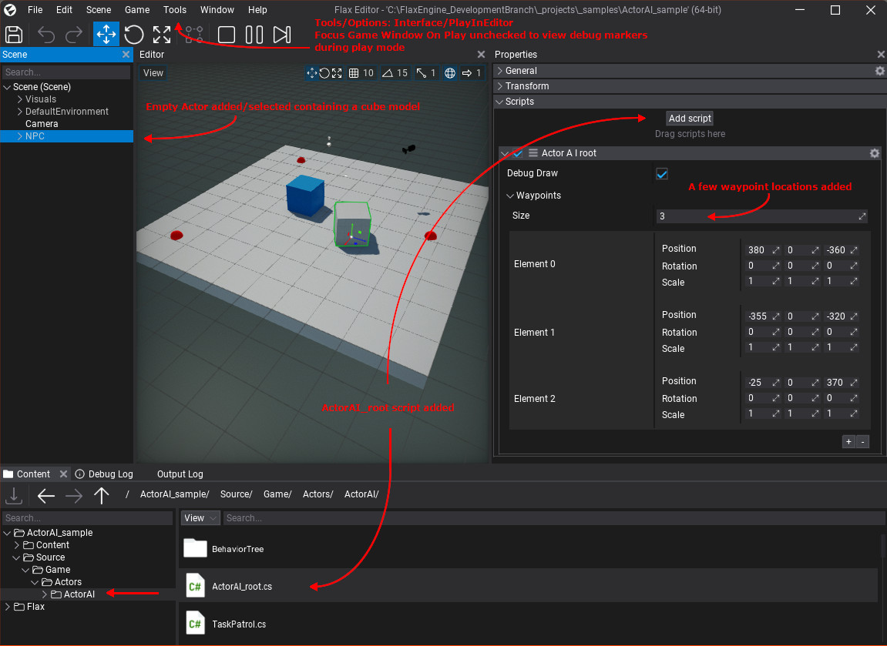

# FlaxEngineSample_ActorAI
Basic Behavior Tree sample for Flax Engine (v1.5)

***note*** As of FlaxEngine v1.8, they now feature visual BT scripting

This sample demostrates a starting point for behavior tree AI.
Project files provided within the Basic Scene template. 

<h2>Basic fast start steps</h2>

https://user-images.githubusercontent.com/125387591/221972135-db50b5cd-b9e2-47ba-bd19-ee9ccc103407.mp4
